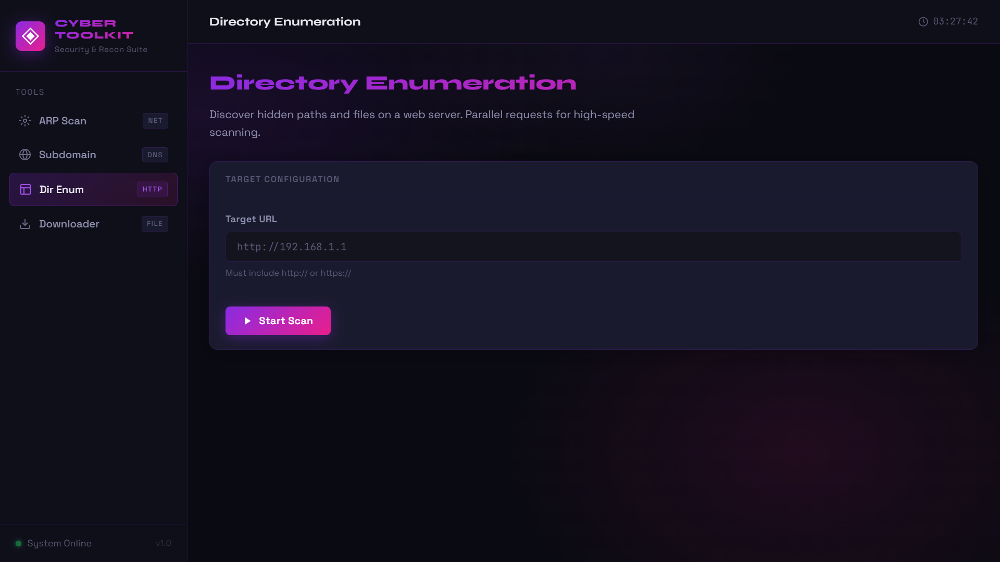

# ⚡ Cyber Toolkit

> A modular, GUI-based cybersecurity toolkit powered entirely by FastAPI.

---

## 🚀 Overview

Cyber Toolkit is a lightweight yet powerful security tool designed to perform essential reconnaissance tasks through a clean web-based interface.

Unlike traditional setups, this project runs **fully on the backend** — FastAPI serves both the API and the frontend UI.

It combines multiple security utilities into a single dashboard, making it easy to scan networks, discover subdomains, enumerate directories, and download files — all from one place.

---

## 🛠 Features

- 🔍 **ARP Network Scanner**
  - Discover active devices on a network
  - Displays IP ↔ MAC mapping

- 🌐 **Subdomain Enumeration**
  - Brute-force subdomains using wordlists
  - Multi-threaded execution

- 📂 **Directory Enumeration**
  - Finds hidden endpoints on websites
  - Detects `200 OK` and `403 Forbidden`

- ⬇️ **File Downloader**
  - Download files directly from URLs
  - Supports multiple file types

- 🎯 **Integrated Web UI**
  - Served directly by FastAPI (`/`)
  - No separate frontend server required
  - Real-time interaction with backend APIs

---

## 🧠 Tech Stack

| Layer       | Technology            |
|------------|----------------------|
| Backend    | FastAPI (Python)     |
| UI Serving | FastAPI StaticFiles  |
| Networking | Scapy                |
| Requests   | Python Requests      |

---
```
## 📁 Project Structure


``ToolKit/
│
├── backend/
│   ├── main.py
│   ├── requirements.txt
│   ├── wordlist.txt
│   │
│   ├── static/              
│   │   ├── index.html
│   │   ├── style.css
│   │   ├── app.js
│   │
│   └── modules/
│       ├── arp.py
│       ├── subdomain.py
│       ├── dir_enum.py
│       ├── downloader.py
│
├── screenshots/
│
└── README.md``
```
---

## ⚙️ Installation & Setup

### 1️⃣ Clone the repository
```bash
git clone https://github.com/Devansh7006/ToolKit.git
cd ToolKit/backend
````

---

### 2️⃣ Install dependencies

```bash
pip install -r requirements.txt
```

---

### 3️⃣ Run the server

```bash
uvicorn main:app --reload
```

---

### 4️⃣ Open in browser

```
http://127.0.0.1:8000
```

✅ UI + API both run from here

---

## 🔌 API Endpoints

All endpoints are prefixed with `/api`

* `/api/arp` → Network scan
* `/api/subdomain` → Subdomain enumeration
* `/api/dir` → Directory brute force
* `/api/download` → File downloader

---

## 📸 Screenshots

### 🖥 ARP Network Scan


### 🌐 Subdomain Enumeration


### 📡 Directory Enumeration



### 📁 File Downloader


---

## 🔐 Disclaimer

This tool is developed strictly for **educational and ethical purposes only**.
Do not use it on networks or systems without proper authorization.

---

## 👨‍💻 Author

**Devansh Goyal**

* GitHub: [https://github.com/Devansh7006](https://github.com/Devansh7006)
