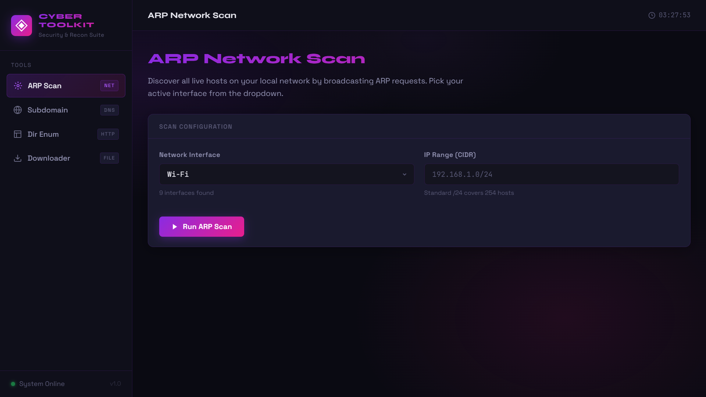
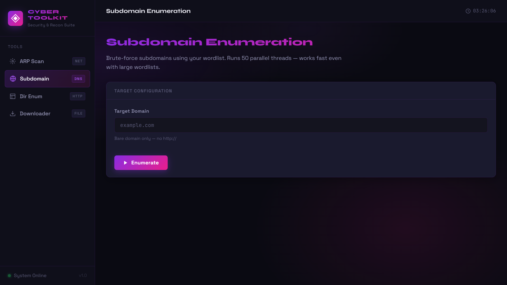
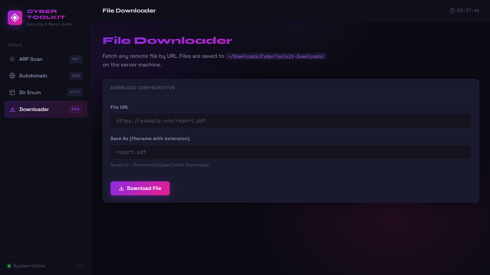

# ⚡ Cyber Toolkit

> A modular cybersecurity toolkit for network reconnaissance, featuring an integrated FastAPI-powered web interface.


---

## 🚀 Overview

Cyber Toolkit is a lightweight yet powerful security tool designed to perform essential reconnaissance tasks through a clean web-based interface.

Unlike traditional setups, this project runs **entirely on the backend** — FastAPI serves both the **API and the frontend UI**, eliminating the need for a separate frontend server.

It combines multiple security utilities into a single dashboard, making it easy to:
- Scan networks
- Discover subdomains
- Enumerate directories
- Download files

—all from one place.

---

## 🧠 Architecture


Browser (UI)
↓
FastAPI Server (Backend)
├── API Routes (/api/*)
├── Static UI (served via /static)
└── Modules
├── ARP Scanner
├── Subdomain Enum
├── Directory Enum
└── Downloader


✔ Single server  
✔ No frontend deployment needed  
✔ Real-time interaction via API  

---

## 🛠 Features

### 🔍 ARP Network Scanner
- Discover active devices on a network
- Displays IP ↔ MAC mapping

### 🌐 Subdomain Enumeration
- Brute-force subdomains using wordlists
- Multi-threaded for fast execution

### 📂 Directory Enumeration
- Finds hidden endpoints on websites
- Detects `200 OK` and `403 Forbidden`

### ⬇️ File Downloader
- Download files directly from URLs
- Supports multiple file types

### 🎯 Integrated Web UI
- Served directly via FastAPI (`/`)
- No separate frontend server required
- Clean, modern dashboard

---

## 🧠 Tech Stack

| Layer        | Technology |
|-------------|-----------|
| Backend     | FastAPI (Python) |
| UI Serving  | FastAPI StaticFiles |
| Networking  | Scapy |
| Requests    | Python Requests |

---

## 📁 Project Structure

```

Cyber-toolkit/
│
├── backend/
│   ├── main.py
│   ├── requirements.txt
│   ├── wordlist.txt
│   │
│   ├── modules/
│   │   ├── arp.py
│   │   ├── subdomain.py
│   │   ├── dir_enum.py
│   │   └── downloader.py
│   │
│   └── static/
│       ├── index.html
│       ├── style.css
│       └── app.js
│
├── screenshots/
│   ├── arp.png
│   ├── Subdomain.png
│   ├── Dir_Er.png
│   └── download.png
│
└── README.md

````

---

## ⚙️ Installation & Setup

### 1️⃣ Clone the repository
```bash
git clone https://github.com/Devansh7006/ToolKit.git
cd ToolKit/backend
````

---

### 2️⃣ Install dependencies

```bash
pip install -r requirements.txt
```

---

### 3️⃣ Run the server

```bash
uvicorn main:app --reload
```

---

### 4️⃣ Open in browser

```
http://127.0.0.1:8000
```

✅ UI + API both run from here

---

## 🔌 API Endpoints

All endpoints are prefixed with `/api`

| Endpoint         | Description           |
| ---------------- | --------------------- |
| `/api/arp`       | Network scan          |
| `/api/subdomain` | Subdomain enumeration |
| `/api/dir`       | Directory brute-force |
| `/api/download`  | File downloader       |

---

## 📸 Screenshots

### 🖥 ARP Network Scan



---

### 🌐 Subdomain Enumeration



---

### 📂 Directory Enumeration


---

### 📁 File Downloader



---

## 🔐 Disclaimer

This tool is developed strictly for **educational and ethical purposes only**.

Do **NOT** use it on networks or systems without proper authorization.

---

## 👨‍💻 Author

**Devansh Goyal**

* GitHub: [https://github.com/Devansh7006](https://github.com/Devansh7006)

